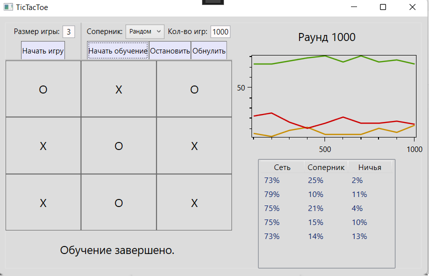

# TicTacToeNN
This is a WPF application themed around a neural network that can play tic-tac-toe. The app provides two main functionalities: training the neural network and playing against it yourself. The used neural network is a  that utilizes  in its training process.
## Features
- Interactive gameplay of tic-tac-toe
- Modifying the playboard size (available size range is [3,5])
- Controlling the training process via Start, Stop and Reset buttons
- Selecting a train partner for the network (random player, boring player, other neural network), as well as the amount of training rounds
- Seeing visual statistics of the training process
## Screenshots
**Start page view**

**In-game page view**

**End-game page view**

**In-training view**

**Finished training view**

**Different playboard sizes**

## Technologies used
- .NET Framework 4.7.2
- C# 7.3
- Visual Studio 2017, refactored with Visual Studio 2022
- OxyPlot plotting library
## Acknowledgments
This project was completed as a coursework on machine learning named "Tic-Tac-Toe Neural Network" ("Нейронная сеть для игры в Крестики-Нолики"). The classes for the neural network and back propagation were based on the  classes.
