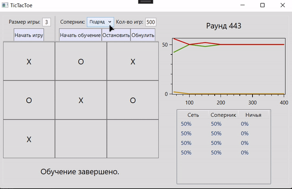

# TicTacToeNN
This is a WPF application themed around a neural network that can play tic-tac-toe. The app provides two main functionalities: training the neural network and playing against it yourself. The used neural network is a <a href="https://en.wikipedia.org/wiki/Feedforward_neural_network">Feedforward neural network</a> that utilizes <a href="https://towardsdatascience.com/qrash-course-deep-q-networks-from-the-ground-up-1bbda41d3677">Q-Learning</a> in its training process.
## Features
- Interactive gameplay of tic-tac-toe
- Modifying the playboard size (available size range is [3,5])
- Controlling the training process via Start, Stop and Reset buttons
- Selecting a train partner for the network (random player, boring player, other neural network), as well as the amount of training rounds
- Seeing visual statistics of the training process
## Screenshots
**Start page view**

**Game mode**

**Training mode**

**Different playboard sizes**

## Technologies used
- .NET Framework 4.7.2
- C# 7.3
- Visual Studio 2017, refactored with Visual Studio 2022
- OxyPlot plotting library
## Room for improvement
- Make it possible for the user to modify the network parameters
- Add the option to see the networks weights
- Add the ability to select the amount of cells needed for the win as well as the playboard size, e.g. 3 cells in a row on a 5x5 playboard
- Make the user interface more aesthetically pleasing
## Acknowledgements
This project was completed as a coursework on machine learning named "Tic-Tac-Toe Neural Network" ("Нейронная сеть для игры в Крестики-Нолики"). The classes for the neural network and back propagation were based on the <a href="http://www.aforgenet.com/">AForge.NET framework</a> classes.
